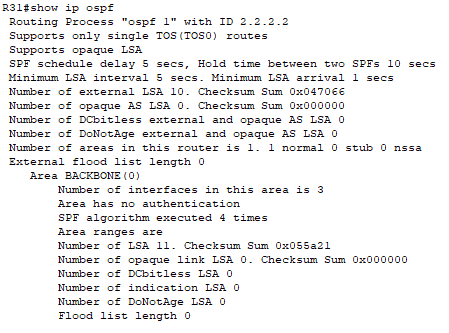
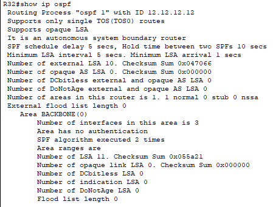
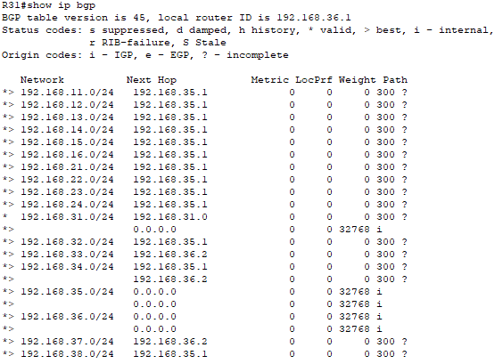

# OSPF et BGP

Ce sont deux protocoles de routage essentiels pour la gestion efficace des réseaux modernes. OSPF est optimal pour le routage intra-domaine avec une convergence rapide, tandis que BGP est indispensable pour le routage inter-domaine avec des capacités de gestion de politiques de routage complexes. Une bonne compréhension et configuration de ces protocoles permettent une infrastructure réseau robuste et fiable.

# Commandes :

**R32 :**
- router bgp 300
- neighbor 192.168.42.1 remote-as 100
- neighbor 192.168.43.2 remote-as 200
- network 192.168.32.0
- network  192.168.38.0
- network 192.168.35.0

- router ospf 1
- router-id 2.2.2.2
- redistribute bgp 300 match internal external 

**R31 :**
- router ospf 1
- router-id 10.10.10.10
- network 192.168.31.0 0.0.0.255 area 0
- network 192.168.38.0 0.0.0.255 area 0
- network 192.168.36.0 0.0.0.255 area 0

- router bgp 300
- redistribute ospf 1 subnets

# Config OSPF :

# Config BGP :

