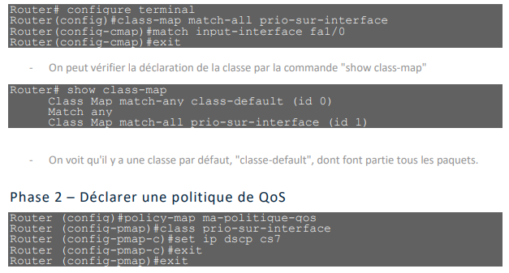
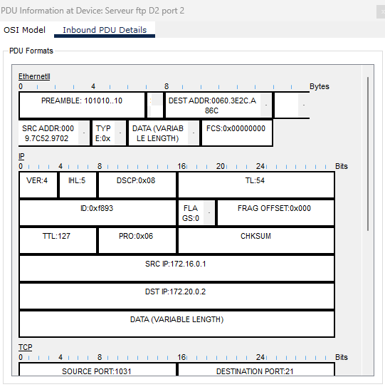

# QOS

# Non activé

# Quels débits avez-vous relevé ?

# Les deux débits sont-il identiques ? Pourquoi ?

- Les débits sont identiques car il n'y a pas de priorisation

# QoS activé en fonction de l'interface source

 

### Une fois les deux postes G1 et H1 connectés au serveur FTP, lancer simultanément les deux téléchargements du même fichier binaire : 

*ftp>get c1841-advipservicesk9-mz.124-15.T1.bin*

### Sur le routeur, vérifier les débits de l’interface Fa0/1 avec la commande suivante : 

*Router#show interfaces FastEthernet 0/1* 

# Quels débits avez-vous relevé ?

**G1 :**

**H1 :**

# Les deux débits sont-ils identiques ? Pourquoi ? 

- On vois une différence de débit car il envoie en priorité les paquets a l'interface du routeur qui est priorisé

En mode "simulation", à partir du poste H1, retrouver le code DSCP correspondant au paquet arrivant dans le routeur par le port Fa1/0 et sortant par le port Fa0/1 Idem pour les paquets arrivant par le port Fa0/0 depuis le poste G1 et sortant par le port Fa0/1

